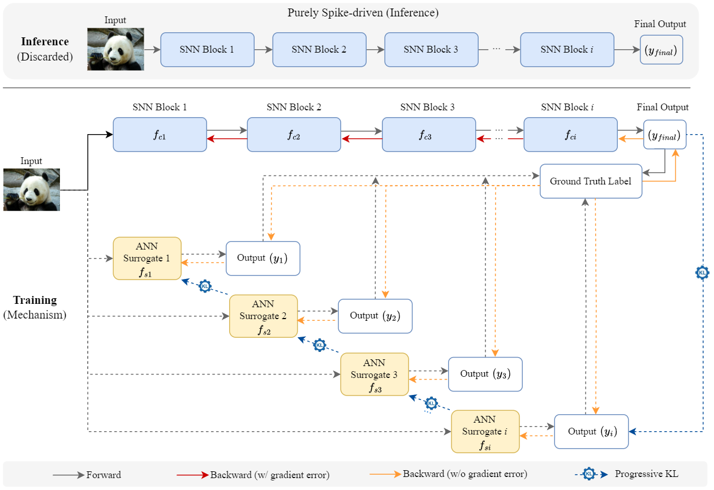
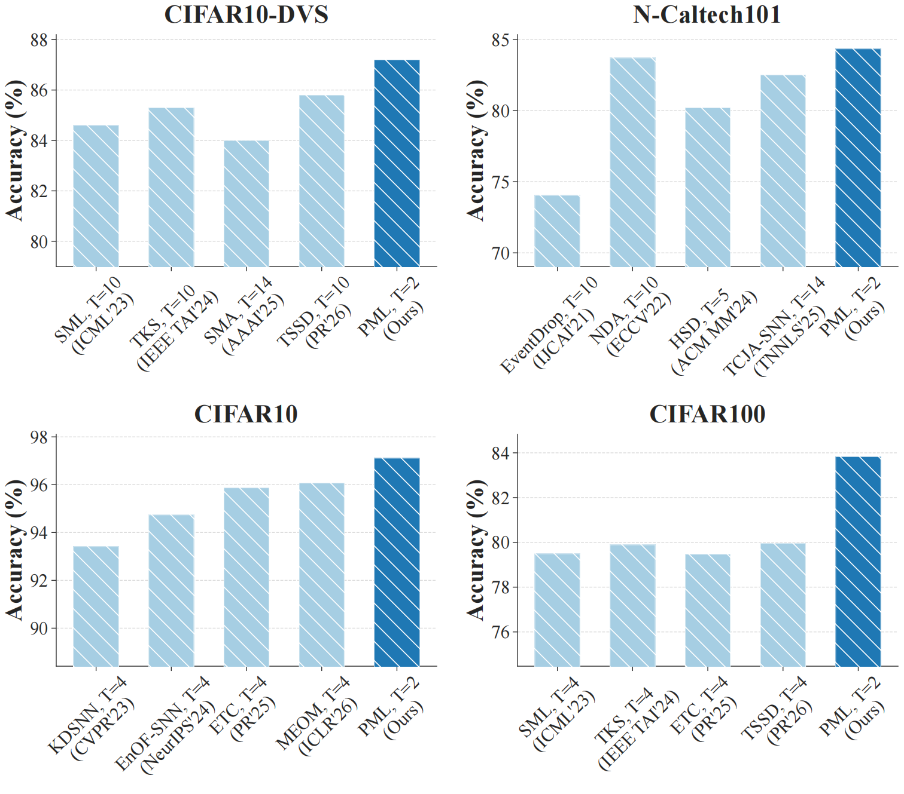

<div align="center" style="font-family: charter;">
<h1>Progressive multi-level self-distillation for spatiotemporal information fusion in spiking neural networks</h1>

<div align="center" style="line-height: 2;">
  <a href="LICENSE" style="margin: 2px;">
    
  </a>
</div>


</div>


## Model Architecture

- This is the repository for paper *Progressive multi-level self-distillation for spatiotemporal information fusion in spiking neural networks*.


<div align="center">
  
</div>

## Comparison with recent methods


<div align="center">
  
</div>

## Prerequisites
- Python 3.9
- Pytorch 2.5.1
- Spikingjelly 0.0.0.0.14
- GPU*2

## How to run

```
torchrun --nnodes=1 --nproc_per_node=2 --master_port=29500 train.py  \
    --data_name "CIFAR10DVS" --num_class 10 \
    --data_path "./dataset/SNN/CIFAR10-DVS/" \
    --Tensorboard --mixup --amp --opt "SGD" \
    --T 6 --lr 0.05 -b 8 --workers 4 --epochs 150 --seed 42 --input_size 48 \
    --method "VGGSNN_PML" 
```
## Note

- [ ] The code will be released in stages. If you have any questions, feel free to send an email to `qingyangswu(AT)gmail DOT com`. I will respond to you as soon as possible. Let us work together to contribute to the development of spiking neural networks.

## Acknowledgments

- [ ] Chongqing Key Laboratory of Brain-inspired Computing and Intelligent Chips
- [ ] National & Local Joint Engineering Research Center of Intelligent Transmission and Control Technology
